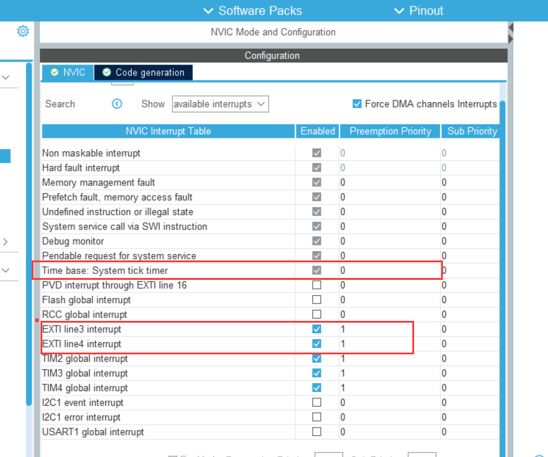

PB5, PE5: LED（PP推挽模式）
PB8: BEEP（PP推挽模式）
PE3, PE4: KEY（下降沿触发模式、内部电阻选择上拉电阻）
PA0: KEY_UP（下降沿触发模式、内部电阻选择下拉电阻）

HAL_Delay是用来消抖按键的，没有的话中断会很不稳定，但是如果在中断中存在delay的话，那就必须设置一下NVIC，否则主程序运行时突然有外部中断的话，主函数会停止运行，整个卡住。

可以将中断处理写在中断处理函数（`void EXTI1_IRQHandler(void)`）里面，或者是中断回调函数（`void HAL_GPIO_EXTI_Callback(uint16_t GPIO_Pin)`）里面。两者的区别是：

- 中断处理函数：处理针对某一种外设的中断。
- 中断回调函数：处理所有的中断。
